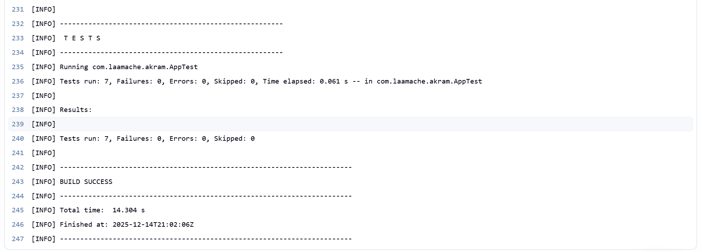
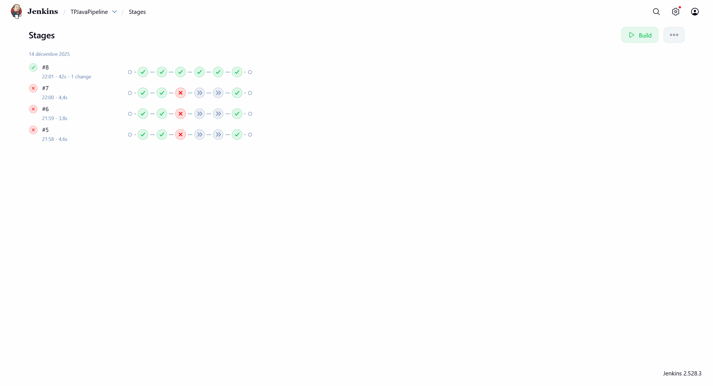

# TP Java Pipeline - Laamache Akram

## 📋 Objectif

Mettre en place une **pipeline Jenkins** utilisant un **agent Docker** pour automatiser le build et les tests d'un projet **Maven Java**.

---

## 🛠️ Prérequis

- **Docker** installé et fonctionnel
- **Jenkins** (local ou dans Docker)
- Image Docker `my-maven-git:latest`

---

## 📁 Structure du projet

```
TPJavaPipeLine-LaamacheAKram/
├── Jenkinsfile           # Pipeline Jenkins
├── Dockerfile            # Image Maven + Git
├── README.md             # Ce fichier
├── pom.xml               # Configuration Maven
├── rapport/
│   └── rapport.md        # Rapport du TP
├── screenshots/
│   ├── pipeline-success.png
│   ├── console-output.png
│   └── tests-passed.png
└── src/
    ├── main/java/...     # Code source
    └── test/java/...     # Tests unitaires
```

---

## 🚀 Installation & Lancement

### 1. Cloner le repository

```bash
git clone https://github.com/VOTRE_USERNAME/TPJavaPipeLine-LaamacheAKram.git
cd TPJavaPipeLine-LaamacheAKram
```

### 2. Build de l'image Docker Maven+Git

```bash
docker build -t my-maven-git:latest .
```

### 3. Lancer Jenkins (si Jenkins est dans Docker)

```bash
docker run -d \
  --name jenkins \
  -p 8080:8080 -p 50000:50000 \
  -v jenkins_home:/var/jenkins_home \
  -v /var/run/docker.sock:/var/run/docker.sock \
  jenkins/jenkins:lts-jdk17
```

### 4. Résoudre les problèmes de permissions Docker (si nécessaire)

```bash
docker exec -u root -it jenkins bash
groupadd docker || true
usermod -aG docker jenkins
chmod 666 /var/run/docker.sock
exit
docker restart jenkins
```

### 5. Configurer le Pipeline dans Jenkins

1. Ouvrir Jenkins : `http://localhost:8080`
2. Créer un nouveau job **Pipeline**
3. Dans **Pipeline** → **Definition** : choisir **Pipeline script from SCM**
4. **SCM** : Git
5. **Repository URL** : `https://github.com/VOTRE_USERNAME/TPJavaPipeLine-LaamacheAKram.git`
6. **Script Path** : `Jenkinsfile`
7. **Save** et **Build Now**

---

## 🧪 Tests locaux (sans Jenkins)

```bash
# Compiler le projet
mvn clean compile

# Lancer les tests
mvn test

# Créer le JAR
mvn package

# Exécuter l'application
java -jar target/tp-java-pipeline-1.0-SNAPSHOT.jar
```

---

## 📸 Captures d'exécution

### ✅ Pipeline réussie



### 📝 Console Output



### 🧪 Tests passés


---

## 📊 Stages de la Pipeline

| Stage | Description |
|-------|-------------|
| **Checkout** | Récupération du code depuis GitHub |
| **Build** | Compilation du code (`mvn clean compile`) |
| **Test** | Exécution des tests unitaires (`mvn test`) |
| **Package** | Création du JAR (`mvn package`) |

---

## 👤 Auteur

**Laamache Akram**

---

## 📄 Licence

Projet réalisé dans le cadre du TP Jenkins Pipeline.
